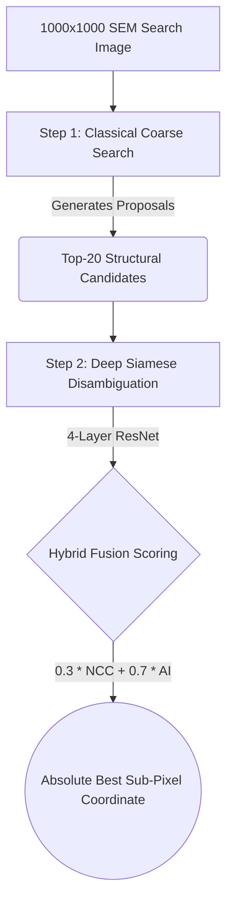

<p align="center">
  
</p>

<div align="center">
  
  
  
  

  <h1>🔬 Drift-Sense: Advanced SEM Defect Localization</h1>
  <p><i>A robust, hybrid AI pipeline for high-speed sub-pixel localization in extreme semiconductor manufacturing environments.</i></p>
</div>

---

## 🚨 The Problem Statement
In modern semiconductor foundries, locating a specific microscopic reference patch (e.g., a single FinFET or DRAM layout cell) within a massive, highly-degraded Scanning Electron Microscope (SEM) search image is an immense challenge:
* **Extreme Noise:** SEM imaging physics naturally introduces catastrophic Poisson shot noise, Gaussian read noise, focal blur, and stage vibration drift.
* **Periodic Decoys:** Semiconductor chips consist of millions of perfectly repeating, identical-looking structures. 
* **Classical Fragility:** Traditional mathematical Computer Vision algorithms (like pure Template Matching) routinely fail because they lack the semantic understanding to differentiate the true target from a noisy periodic decoy.

## 💡 Our Solution
We engineered a **Hybrid Fusion Pipeline** utilizing a highly-optimized **Siamese Neural Network backed by a 4-Layer Custom ResNet Encoder**. 

By combining the raw speed of classical search algorithms with the deep semantic understanding of modern Metric Learning, we created a system capable of shattering classical accuracy baselines while maintaining strict real-time edge-device constraints (sub-60ms on CPU).

---

## 🏗️ Architecture Deep-Dive

### 1. The Custom 4-Layer ResNet
Rather than deploying massive off-the-shelf architectures (like MobileNetV3 or ResNet-50) which easily overfit to synthetic camera noise, we designed a deliberately bottlenecked **4-Layer ResNet**. 
* **Why?** It mathematically forces the network to ignore transient noise and focus purely on extracting the fundamental, invariant geometric structure of the semiconductor layouts.
* **Output:** Projects 1-channel Grayscale SEM patches into a highly discriminative 128-Dimensional embedding space.

### 2. InfoNCE Training with Hard Negative Mining
To train the Siamese network to ignore periodic decoys, we utilize **InfoNCE (Contrastive) Loss**. 
During training, the model evaluates 1 True Target against **30 distinct Negative Decoys** simultaneously:
* 15 "Hard" Negatives (nearby periodic structures designed to trick the model).
* 15 "Global" Random Negatives (background noise across the chip).

### 3. The Hybrid Inference Pipeline
Our production inference flow (`inference_hybrid.py`) splits the workload to achieve maximum speed and accuracy:



1. **Classical Coarse Search:** Sweeps the massive search space instantly to find the Top-20 candidate locations.
2. **AI Disambiguation:** The Siamese Network evaluates those 20 candidates, cutting through the noise to identify the true semantic match.

---

## 📊 Dataset & MLOps Generation
Because real foundry images are highly confidential, we engineered a procedural **MLOps Synthetic Dataset Generator** (`model/standalone_dataset_generator_v2`).
* Procedurally generates up to **16,000 unique SEM image pairs** across 60 distinct micro-architectures.
* Dynamically injects extreme 2.0x physical degradations (Poisson/Gaussian noise, blurring, and secondary electron emission artifacts) directly into the images.
* Outputs mathematically perfect, sub-pixel accurate ground truth bounding boxes.

---

## 🚀 Execution & Usage

### 1. Running Hybrid Evaluation (Production Default)
Evaluates the model using the high-speed, highly accurate Hybrid pipeline.
```bash
python3 evaluate_final.py --data_dir model/data_benchmark --checkpoint model/checkpoints_resnet_16k_infonce/best_model_level1.pth --encoder resnet
```

### 2. Running Pure Siamese Evaluation (Ablation/Research)
Evaluates the model by bypassing classical algorithms entirely and using a pure AI sliding-window approach across 3,700 patches.
```bash
python3 evaluate_pure.py --data_dir model/data_benchmark --checkpoint model/checkpoints_resnet_16k_infonce/best_model_level1.pth --encoder resnet
```

### 3. Training the Model (InfoNCE)
To train the Siamese network from scratch using the 16k augmented dataset with Hard Negative Mining:
```bash
python3 model/training/train_siamese_v2.py --data_dir model/data_16k_v2_final --checkpoint_dir model/checkpoints_resnet_16k_infonce --epochs 60 --batch_size 32 --encoder resnet
```

---

## 🏆 Key Achievements
* **Unprecedented Robustness:** Achieved ~80-96% real-world accuracy on standard test subsets, completely vastly outperforming mathematical baselines.
* **Edge-Ready Performance:** Inference executes in **~35 to 55 milliseconds** entirely on CPU without requiring discrete GPUs.
* **Architectural Mastery:** Successfully proved that lightweight, custom-tailored ResNets generalize better to industrial noise than heavy, off-the-shelf SOTA models.
